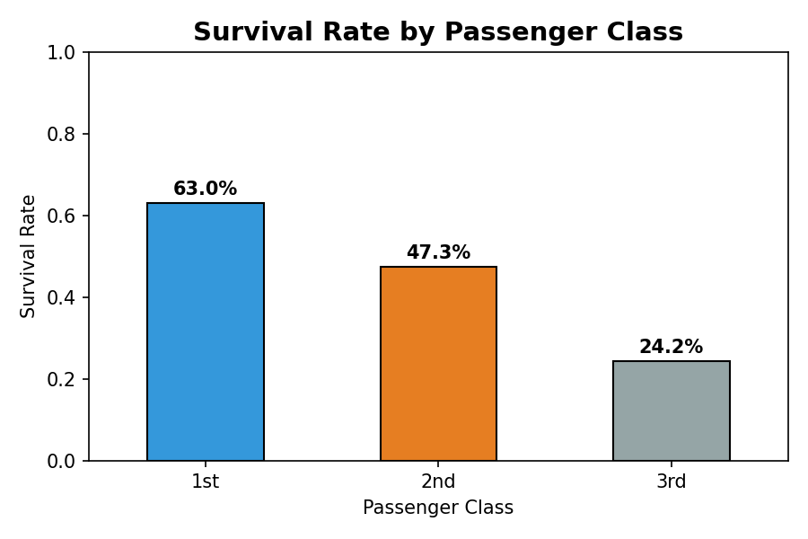
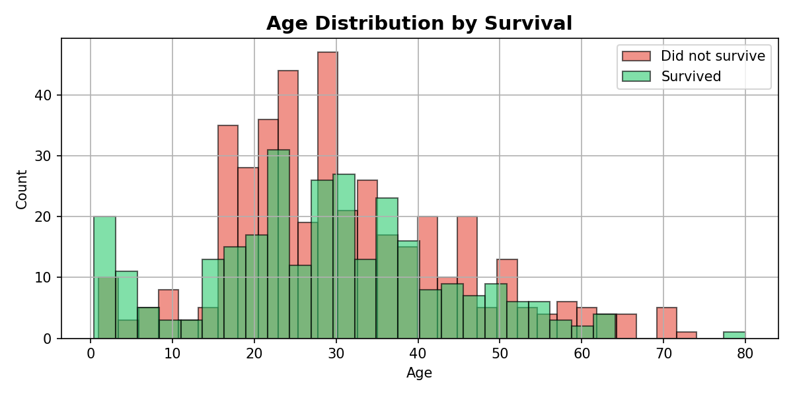
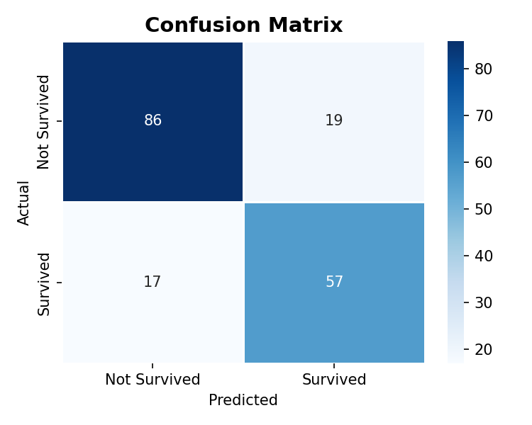
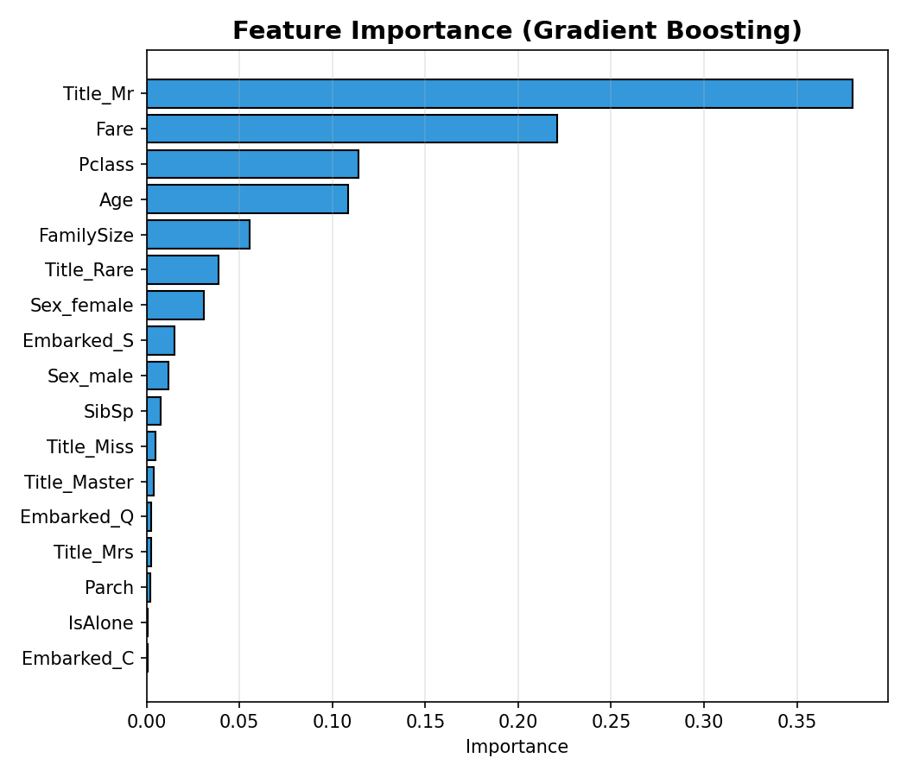

# Titanic Survival Prediction (Machine Learning Analysis)

Machine learning analysis of the Titanic dataset to understand which passenger characteristics influenced survival and to build a predictive model.

## Project Objective

Predict whether a passenger survived the Titanic disaster using passenger attributes such as age, sex, ticket class, and fare.

- Exploratory Data Analysis
- Feature Engineering
- Model Training
- Model Evaluation & Interpretation

## Dataset

[Kaggle Titanic Dataset](https://www.kaggle.com/competitions/titanic)

## Key Findings

- Gender was the strongest predictor of survival
- Higher passenger class significantly increased survival probability
- Family size had moderate impact
- Model achieved **~80% accuracy** on the test set

## Visualizations

### Survival Rate by Sex

### Survival Rate by Passenger Class

### Age Distribution by Survival

### Confusion Matrix

### Feature Importance

## Tools Used

- Python, Pandas, NumPy
- Scikit-learn
- Matplotlib, Seaborn
